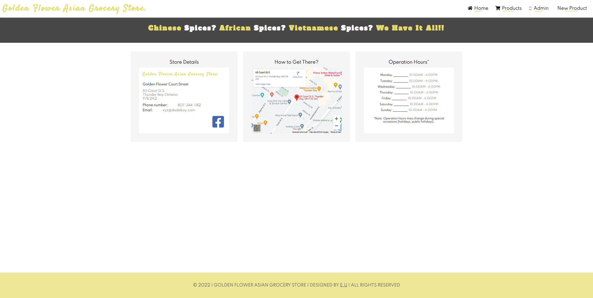
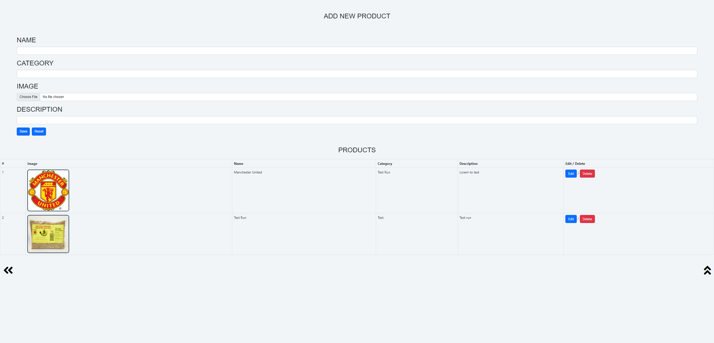
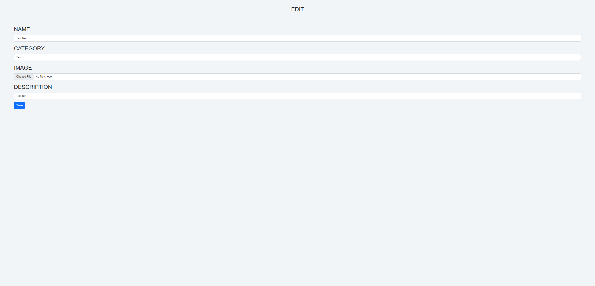

# Full-Stack Web Application using Vanilla JavaScript and Java
Hi everyone!   
This is a Full-Stack web application (Grocery Store) that allows anyone
to make CRUD operations. As I further my knowledge in Spring Boot, I'll 
implement a login in system where only an admin can make CRUD operations.

## Topics
#### Front-end
* HTML
* CSS
* JavaScript
* Bootstrap
#### Back-end
* Java
* Spring Boot
* MVC
* Spring JPA
* Spring Boot Test (Integration and Unit testing)
* Solid Principles
* REST API
* H2 Database (to change to MySQL when deployed)

## TODO
* Login system using Spring Security.

## Knowledge gained
* Interaction between the client side and the backend using routes or APIs.
* Validating user inputs or JSON object using Spring Boot Validation.
* Fetching data using a GET api.
* Sending data from a FORM using a POST api.
* Editing an existing object using a PUT api
* Deleting an existing product using a DELETE api
* Logic of how images are uploaded to a database and served to the client.
* Industry standard testing using Integration and Unit testing.

## Visuals
### Home Page

### Add New Product

### Edit Page

